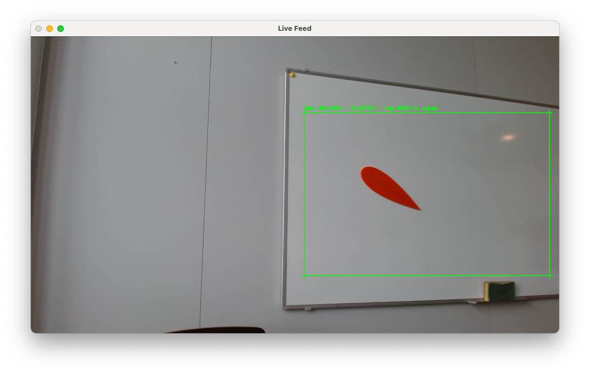
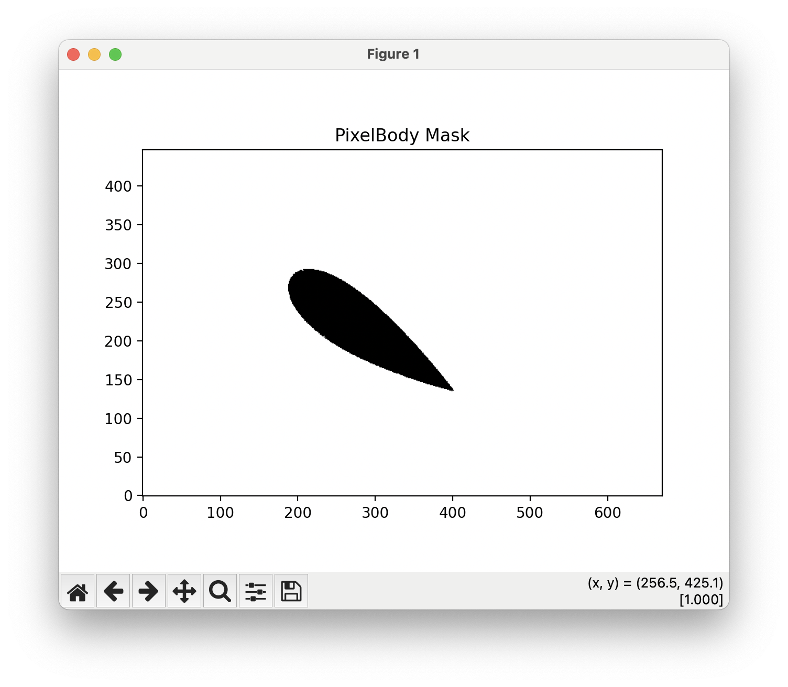
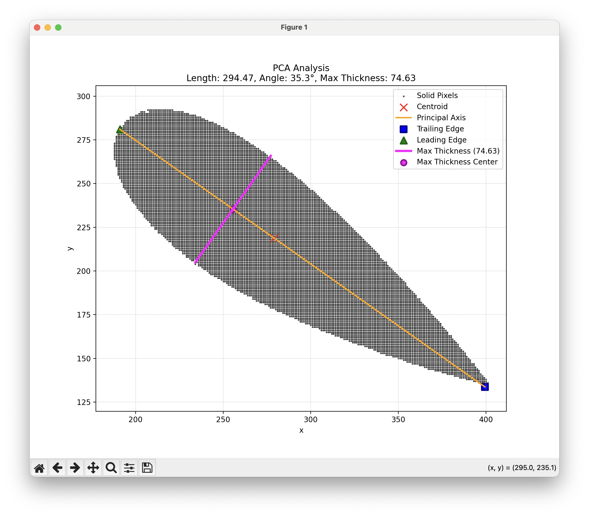

# PixelBodies.jl
Runs WaterLily using a body constructed from a pixel image mask (picture).


This is a mixed project containing a nested Python project within a Julia project.
The Python package 'picture_sim_python_app' handles the image capturing, recognition and displaying results,
while the Julia package handles the simulation of WaterLily. Python uses a simple cli 
to interact with a Julia script that calls WaterLily.

## Project setup

#### Julia project (PixelBodies.jl)
The Julia project is defined at the root folder level, and the project
environment is activated by typing 

```julia
using Pkg
Pkg.activate(".") 
```

from the Julia REPL at the root folder location. To
install dependencies then simply type

```julia
Pkg.instantiate() 
```

NOTE: At the moment, Pathogen.jl is not registered in the
General registry, so you need to add it manually by cloning the
[Pathlines.jl](https://github.com/WaterLily-jl/Pathlines.jl)
repo and then using `Pkg.develop(path="path_to_cloned_repo")` to point Julia to 
the local copy. This needs to be done before running `Pkg.instantiate()`.

#### Python project (picture_sim_python_app)
To initialize the Python project, first create a Python virtual environment
in the folder 'picture_sim_python_app' using venv (or your preferred package manager):

```
python -m venv .venv
```
Then install the project dependencies from the requirements.txt file. Using pip:

```
pip install -r requirements.txt
```

## Using picture_sim_python_app

To run the image recognition and subsequent interface with WaterLily,
run the file `run_pixel_sim.py`. The settings of the program are set in
`configs/settings.yaml`. 

IMPORTANT: If you are running a Windows device, and using an external camera,
you need to change `camera_index` to `1`, otherwise leave as `0` if using an
integrated camera.

### Capturing an object using the camera and starting the simulation
When running the program, a prompt will appear in the cli requesting to press either
`enter` or `r` (use r once, then enter for subsequent runs).

A window will open showing the camera feed. You can select
the image recognition field of view by dragging a rectangular blue box with your mouse.
The box will turn green when you release the mouse button. To confirm the selection, press
`space` (be sure to be selecting the window when pressing the key).




If `image_recognition_debug_mode: true ` in `configs/settings.yaml`, a window will pop up
showing the recognized object (solid is black, fluid is white). If the object is not recognized
properly, try changing either the threshold values in `configs/settings.yaml`, or changing the
`solid_color` mode.



After closing the first window, a second window will pop up showing the PCA component analysis,
which attempts to automatically determine the characteristic length and angle of attack of the object (assuming a
`U(1,0)` flow direction).



If all looks good, close the window and the simulation will start.

Once the simulation finishes, the program will remain in an idle state. You can then either press
`enter` to re-take a picture and start over, `r` to select a new region of interest, 
or `q` to quit the program.

### Visualizing results
The simulation results are saved in the folder `picture_sim_python_app/output` as a series of `.gif` files.
To visualize the results, you can run `persistent_gif_display_pyqt5.py`, which will run an independent
persistent instance which loads 2 gifs side by side and loops them indefinitely. 

### Camera setup tips
Make sure your camera (either integrated or external)
is pointing towards the object of interest. The object of interest
should be of a dark hue, while the backround is ideally white. For best results, avoid
reflections and use a red-colored object with the mode `solid_color: red` selected from
`settings.yaml` (this can filter blue/green hues from the background such as shadows).


## Using precomputed results
For a simple demonstration of the flow around airfoils, the mode `use_precomputed_results` was created.
To start, you need to crete a full batch of simulations for 3 different airfoil types (NACA0002, NACA0015, NACA030),
which is handled by the script `create_airfoil_batch.jl`. This will systematically run simulations for all angles of
attack (0 to 360 degrees, by default every 3 degrees).

if running `run_pixel_sim.py` with `use_precomputed_results:true`, assuming you are using one of the 3 supported airfoils,
the program will simply detect the airfoil type and angle of attack, and load the corresponding precomputed results. If 
you want to run the WaterLily simulation instead, make sure to set `use_precomputed_results:false`.